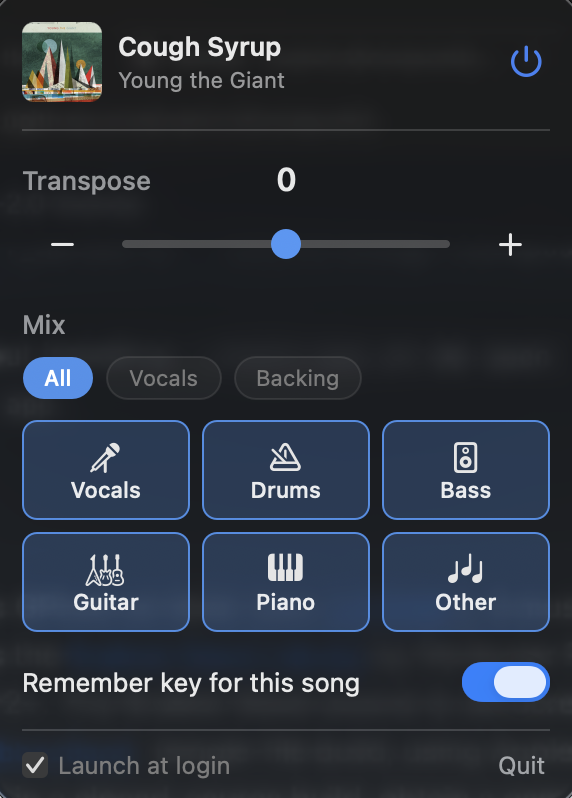

# Transposify

A macOS menu-bar app that lets you **transpose and mix Spotify songs in
realtime**.

https://github.com/user-attachments/assets/f7157fe1-7879-4905-acac-966362948482

<p align="center">
  
</p>

## Install

```sh
git clone https://github.com/evanhu1/transposify.git
cd transposify
./install.sh
```

That builds the app, ad-hoc-signs it, installs it to `/Applications`, and
launches it. On first launch macOS asks for **Microphone** access. That is the
permission Core Audio uses to capture Spotify's audio; it never touches your
real microphone. Click **Allow**, then look for the `𝄞` in your menu bar.

### Updating

From the same clone used for the original install:

```sh
cd /path/to/transposify
git switch main
git pull --ff-only
./install.sh
```

**Requirements:** macOS 14.4 or later, the Spotify desktop app, and Apple's
command-line tools (`xcode-select --install` if `swift` isn't found).

**Uninstall:**

```sh
rm -rf /Applications/Transposify.app && tccutil reset Microphone com.evanhu.transposify
```

## Stem separation

**Mix** splits the track into six stems (vocals, drums, bass, guitar, piano, and
everything else) and plays back only the ones you keep. Drop the vocal to sing
lead, or keep vocal and drums to learn a part. It runs live, on your Mac.

It needs a one-time model download. Open the popover and click **Download** next
to "Isolating needs a 118 MB model". The model lands in
`~/Library/Application Support/Transposify/` and is checked against a SHA-256
built into the app, so a corrupted or substituted file is refused. Until it is
there, every mix except **All** stays greyed out.

To build it yourself instead:

```sh
./install-model.sh
```

That converts Meta's HTDemucs to Core ML locally, in about ten minutes. The
converter is vendored, the Python environment is version- and hash-locked, and
the checkpoint is mirrored in this project's own `model-v1` release and verified
before conversion, so it still works the day Meta's CDN goes away. Provenance
and third-party notices:
[`tools/htdemucs-coreml/`](tools/htdemucs-coreml/README.md).

## How it works

Spotify never exposes its decoded audio. It is DRM-protected, so no injected
code (Spicetify etc.) can reach the stream for DSP. The only way to pitch-shift
it is to capture Spotify's audio _output_ and process it before your speakers:

```
Spotify ─► Core Audio process tap (muted when tapped) ─► ring buffer
                                                              │
                              ┌───────────────────────────────┘
                              ▼
              HTDemucs via Core ML, sliding 7.8 s window ─► ring buffer
                              │
  popup sets semitones ─► Rubber Band R3 ◄── source node
                                  │
                                  └─► default output device
```

- **Capture**: a Core Audio _process tap_ (`AudioHardwareCreateProcessTap`,
  macOS 14.4+) grabs Spotify's audio alone, with no virtual device and no
  extension. It is created _muted when tapped_, so Spotify's own output is
  silenced and you hear only the processed copy.
- **Transpose**: the
  [Rubber Band Library](https://breakfastquay.com/rubberband/) **R3 ("finer")
  engine** in real-time mode, run inside the audio render callback. Its latency
  is higher than Apple's built-in unit, which does not matter when you sing
  _along to_ the output. Verified accurate to <0.1%.
- **Untouched playback**: the pipeline engages only while Spotify plays and
  there is something to do (`pitch ≠ 0`, or a mix that drops a stem). With
  nothing to do it runs on until the next track change, then stands down and
  leaves Spotify bit-perfect at zero latency.
- **Pausing freezes it**: pause holds the pipeline rather than tearing it down,
  so resume continues from the exact sample. Teardown would discard the audio
  still in flight, which Spotify never replays.
- **Now playing**: Spotify's `PlaybackStateChanged` distributed notification
  (instant, no polling). Per-song settings key off the same track ID.

## How the live separation works

Live separation is a sliding-window problem. HTDemucs sees **7.8 seconds at a
time** and takes about **105 ms** per window on an M4 Max.

```
     ── 7.8 s window the model actually sees ──
┌───────────────────────────────────────────────┐
│        past context        │ keep │ lookahead │
└───────────────────────────────────────────────┘
                             └ hop ─┘           └─ newest audio captured
```

**Hop** is how often the model runs, and the block size the audio comes out in.
GPU duty is `inference ÷ hop`: every second is about 10% duty, every
quarter-second about 40%. A smaller hop means fresher output at the cost of
power, and only while separating, since **All** copies the window through
untouched.

**Lookahead** is how much captured audio sits _after_ the part being kept.
Future context helps: a held vowel and a cymbal decay are far easier to tell
apart once you have heard what follows. The benefit has a sharp knee.

| lookahead               | 0 s  | 0.25 s | 0.5 s | 1.0 s | 2.0 s |
| ----------------------- | ---- | ------ | ----- | ----- | ----- |
| quality (dB vs offline) | 19.3 | 20.5   | 22.0  | 23.2  | 24.2  |

A quarter-second captures most of it. Beyond half a second it buys almost
nothing.

**Delay** is the three added together, `hop + lookahead + inference`, plus a
small output buffer.

### Hop is chosen automatically

A hop at 40% duty on an M4 Max would demand nearly 300% on an M1, where the
worker falls permanently behind and the audio breaks up. One hard-coded value
cannot serve both.

So the model is timed once as it loads, which also absorbs Core ML's first-run
specialisation and keeps it out of the audio path. The measurement is persisted
and the hop scaled to roughly **40% GPU duty**, clamped to 0.15–2.0 s:

| Mac       | inference | hop     | delay   |
| --------- | --------- | ------- | ------- |
| M4 Max    | ~105 ms   | ~0.26 s | ~0.85 s |
| mid-range | ~300 ms   | ~0.75 s | ~1.8 s  |
| M1        | ~700 ms   | ~1.75 s | ~3.8 s  |

### Every mix carries the same delay, including All

Separated audio exists only once the input has passed it by
`lookahead + inference`, so playing it in time requires a delayed output. A
zero-delay **All** cutting over to a delayed stream would have to gap, repeat,
or bend the tempo.

So **All** runs the same window and hop machinery and copies the input instead
of predicting it: same delay, no GPU. Switching is then only a flag. The worker
already holds the history and lookahead the new mix needs, so the next block
comes out changed and the existing crossfade joins it to the previous one. No
gap, no repeat, no drift. Preparation, including a cold model load, happens
underneath audio that keeps playing.

### What the knobs actually buy

The quality figures above compare streaming against _whole-file offline Demucs_,
so they measure what streaming gives up, and say nothing about separation
quality itself. Offline Demucs scores about **9 dB** against true isolated
stems. That is the model's own error, and it is what you hear as faint bleed.
Streaming sits ~22 dB below the offline result, some 13 dB below that error, so
it adds almost nothing audible.

So hop and lookahead buy latency and power while leaving quality alone. Sweeping
them from 2.1 s of delay to 0.5 s moved the figure from 23.2 dB to 22.5 dB, and
it wobbled without trending. The original 2 s delay bought nothing.

Better separation needs a better model. The next one up (Mel-Band RoFormer, ~2
dB better) is roughly 12x too slow to stream.

## Diagnostics & tests

```sh
swift probe.swift                              # OSStatus of each Core Audio tap call
TRANSPOSIFY_SELFTEST=1 .build/debug/Transposify  # headless engagement state-machine test
TRANSPOSIFY_RBTEST=1   .build/debug/Transposify  # Rubber Band pitch-accuracy check (440Hz +7st)
```

To build without installing: `./make-app.sh && open Transposify.app`.

## License

This project is **GPLv2-or-later** (see [`LICENSE`](LICENSE)). It must be: it
statically links the
[Rubber Band Library](https://breakfastquay.com/rubberband/) by Particular
Programs Ltd, which is GPLv2+. The Rubber Band source is vendored under
[`Sources/CRubberBand`](Sources/CRubberBand) (single-file build, using Apple's
vDSP FFT). If you want to ship a closed-source build, obtain a commercial Rubber
Band licence from Breakfast Quay.
