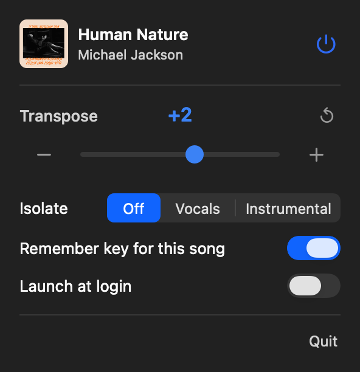

# Transposify

A macOS menu-bar app that lets you **sing along to any Spotify song in your
range** — shift the key up or down by semitones in real time, pitch without
tempo change. It stays out of the way: a small `𝄞 +2` / `𝄞 −3` / `𝄞 0` in the
menu bar, and a popup when you click it. Settings are remembered per song.

<p align="center">
  
</p>

## Install

You build it on your own Mac with one script. Because it's compiled locally,
macOS doesn't quarantine it — **no Apple Developer account, no notarization, no
"unidentified developer" warning.**

```sh
git clone https://github.com/evanhu1/transposify.git
cd transposify
./install.sh
```

That builds the app, ad-hoc-signs it, installs it to `/Applications`, and
launches it. On first launch macOS asks for **Microphone** access — that's the
permission Core Audio uses to capture Spotify's audio; it never touches your
real microphone. Click **Allow**, then look for the `𝄞` in your menu bar.

### Upgrade an existing clone

From the same clone used for the original install:

```sh
cd /path/to/transposify
git switch main
git pull --ff-only
./install.sh
```

The installer stops the running copy, rebuilds it, replaces the app in
`/Applications`, and launches the update. It does not touch song settings,
preferences, the login-item choice, or the downloaded vocal-removal model in
`~/Library/Application Support/Transposify/`. If `git pull --ff-only` reports
local changes or a divergent branch, preserve or commit that work before
updating rather than deleting it.

Because each local build is ad-hoc signed, macOS may ask again for Microphone
or Automation access after an update. Allowing Automation lets Transposify read
Spotify's state immediately at launch; playback notifications still recover on
the next play/pause if it is not granted.

**Requirements:** macOS 14.4 or later, the Spotify desktop app, and Apple's
command-line tools (`xcode-select --install` if `swift` isn't found).

**Uninstall:**
```sh
rm -rf /Applications/Transposify.app && tccutil reset Microphone com.evanhu.transposify
```

## Vocal removal

Isolating needs a one-time model download: open the
popover and click **Download** next to "Best needs a 142 MB model". It lands in
`~/Library/Application Support/Transposify/` and is checked against a SHA-256
built into the app, so a corrupted or substituted download is refused rather
than installed. Until it's there, both isolating modes stay greyed out.

If you'd rather build the model yourself than trust a binary:

```sh
./install-model.sh
```

That converts Meta's HTDemucs to Core ML locally and installs it to the same
place. It takes about ten minutes. The converter source is vendored, the full
Python environment is version- and hash-locked, and the exact model checkpoint
is mirrored in the `model-v1` release and SHA-256 verified before conversion.
Converter provenance and third-party notices are in
[`tools/HTDemucsCoreML/`](tools/HTDemucsCoreML/README.md).

**Why the delay.** Separating a moment of audio well needs to see slightly past
it, so `Best` buffers about a second of lookahead and emits a second at a time —
roughly two seconds behind Spotify. That is affordable here because you sing
*along to* the output rather than monitoring yourself through it. Pause and
resume freeze and continue that delayed stream immediately without losing or
duplicating audio. A seek or skip reaches your ears only after the already
buffered audio has played. `Fast` has no such delay.

Measured on an M4 Max: one 7.8 s window takes ~130 ms on the GPU, so the model
runs at about 15x realtime and uses a fraction of the machine. The model is held
in memory (on the order of a gigabyte) only while `Best` is selected.

## Using it

Click the menu-bar item to open the popup:

- **Now playing** — album art, track and artist. Art comes from Spotify's
  AppleScript interface, so it needs Automation permission; without it the
  popover just shows a placeholder.
- **Transpose** — `−` / value / `+`, or the slider (±12 semitones). *Reset*
  (↺) appears when shifted.
- **Isolate** — `Off` / `Vocals` / `Instrumental`.
  Neural source separation (HTDemucs) either keeps the vocal and drops the
  backing, or the reverse. Both add about two seconds of delay between Spotify
  and what you hear. See [Vocal removal](#vocal-removal).
- **Remember key for this song** — on by default; your setting auto-applies when
  that track plays again. New songs start at the original key.
- **Launch at login** — register as a login item via `SMAppService`.

The menu-bar item (treble clef + signed value) always reflects the current
offset, at fixed width so it never shifts. The app auto-adjusts when you switch
output devices (e.g. plug in headphones) and engages only while Spotify is
playing.

## How it works

Spotify's desktop client never exposes its decoded audio — it's DRM-protected,
so no injected code (Spicetify etc.) can touch the stream for DSP. The only way
to pitch-shift it is to capture Spotify's audio *output* and process it before
your speakers:

```
Spotify ─► Core Audio process tap (muted-when-tapped) ─► ring buffer
                                                              │
                              ┌───────────────────────────────┘
                              ▼
             [Best]  HTDemucs via Core ML, sliding 7.8 s window ─► ring buffer
             [Fast]  mid/side centre cancellation (in the render callback)
                              │
  popup sets semitones ─► Rubber Band R3 ◄── source node
                                  │
                                  └─► default output device
```

- **Capture**: a Core Audio *process tap* (`AudioHardwareCreateProcessTap`,
  macOS 14.4+) grabs only Spotify's audio — no virtual device, no extension. The
  tap is created *muted-when-tapped*, so Spotify's untouched output is silenced
  and you hear only the processed copy.
- **Transpose**: the [Rubber Band Library](https://breakfastquay.com/rubberband/)
  **R3 ("finer") engine** in real-time mode — a state-of-the-art music pitch
  shifter, run directly in the audio render callback. Latency is higher than
  Apple's built-in unit, but that's irrelevant here (you sing *along to* the
  output, so there's no monitoring loop). Verified accurate to <0.1%.
- **Pristine passthrough at 0**: the pipeline engages **only** while Spotify is
  playing *and* there's something to do (`pitch ≠ 0` or karaoke on). At 0 with
  karaoke off the tap is fully torn down, so Spotify plays untouched —
  bit-perfect, zero added latency. It also disengages when you pause.
- **Now playing / per-song memory**: read from Spotify's `PlaybackStateChanged`
  distributed notification (instant, no polling), keyed by track ID.

## How the live separation works

Isolating a track in real time is a sliding-window problem. HTDemucs looks at
**7.8 seconds at a time** and takes about **110 ms** to do it on an M4 Max —
both fixed by the converted model. Everything else is a choice about how often
to slide that window and which part of each result to keep.

```
        ── 7.8 s window the model actually sees ──
   ┌───────────────────────────────────────────────┐
   │        past context        │ keep │ lookahead │
   └───────────────────────────────────────────────┘
                                └ hop ─┘           └─ newest audio captured
```

**Hop** is how often the model runs, and how big a block the audio comes out
in. GPU duty is simply `inference ÷ hop`: run it every second and the GPU is
busy 11% of the time; every quarter-second and it's 44%. A smaller hop means
fresher output at the cost of power — and only while actually separating, since
`Off` copies the window through without touching the model.

**Lookahead** is how much already-captured audio sits *after* the part being
kept. Future context genuinely helps — whether a sound is a held vowel or a
cymbal decay is much clearer once you have heard what follows. It has a sharp
knee:

| lookahead | 0 s | 0.25 s | 0.5 s | 1.0 s | 2.0 s |
|---|---|---|---|---|---|
| quality (dB vs offline) | 19.3 | 20.5 | 22.0 | 23.2 | 24.2 |

A quarter-second captures most of the benefit; beyond half a second it buys
almost nothing.

**Delay** is those three added together — `hop + lookahead + inference`. You
wait for the future context to exist, wait to compute it, then wait for your
block to fill.

### Hop is chosen for your Mac, not for mine

GPU duty is `inference / hop`, so a hop that sits at 44% duty on an M4 Max
would demand well over 100% on an M1 — the worker would fall permanently
behind and the audio would break up. A single hard-coded value cannot serve
both machines.

So the model is timed once, right after it loads (which also absorbs Core ML's
first-run specialisation, keeping that cost out of the audio path). The
measurement is persisted, and the hop is scaled to hit roughly **40% GPU duty**,
clamped to 0.15–2.0 s. Faster Macs get lower latency; slower Macs get audio
that keeps up. Roughly:

| Mac | inference | hop | delay |
|---|---|---|---|
| M4 Max | ~175 ms | ~0.44 s | ~0.7 s |
| mid-range | ~300 ms | ~0.75 s | ~1.1 s |
| M1 | ~700 ms | ~1.75 s | ~2.7 s |

### Every mode carries the same delay, including Off

Separated audio for a moment only exists once the input has passed it by
`lookahead + inference`. Playing it at its natural time therefore *requires*
the output to be delayed. A zero-delay `Off` cutting over to a delayed stream
would have to insert a gap, repeat a couple of seconds, or bend the tempo.

So `Off` runs the same window and hop machinery and just copies the input
instead of predicting it — same delay, no GPU. Because every mode is delayed
identically, switching is only a flag: the worker already holds the history and
the lookahead the new mode needs, so the next block comes out separated and the
existing crossfade joins it to the previous one. No gap, no repeat, no drift.
Any preparation — even a cold model load — happens underneath audio that keeps
playing.

### Why the delay is small now

The quality figures above are measured against *whole-file offline Demucs*:
how close streaming gets to what the model would do seeing the entire song at
once. They are not the separation quality itself. Offline Demucs is only about
**9 dB** against true isolated stems — that is the model's own error, and it is
what you actually hear as faint bleed. Streaming sits ~22 dB below the offline
result, i.e. roughly 13 dB below the model's own error, so it contributes
essentially nothing.

Which means hop and lookahead control **latency and power, not quality**.
Sweeping them from 2.1 s of delay down to 0.5 s moved the number from 23.2 dB
to 22.5 dB and wobbled rather than trended — noise, not signal. The original
2 s delay was buying nothing.

If you want better separation, none of these knobs will do it; you are at the
model's ceiling, and the next model up (Mel-Band RoFormer, ~2 dB better) is
roughly 12x too slow to stream.

## Diagnostics & tests

```sh
swift probe.swift                              # OSStatus of each Core Audio tap call
TRANSPOSIFY_SELFTEST=1 .build/debug/Transposify  # headless engagement state-machine test
TRANSPOSIFY_RBTEST=1   .build/debug/Transposify  # Rubber Band pitch-accuracy check (440Hz +7st)
```

To build without installing: `./make-app.sh && open Transposify.app`.

## License

This project is **GPLv2-or-later** (see [`LICENSE`](LICENSE)). It must be — it
statically links the [Rubber Band Library](https://breakfastquay.com/rubberband/)
by Particular Programs Ltd, which is GPLv2+. The Rubber Band source is vendored
under [`Sources/CRubberBand`](Sources/CRubberBand) (single-file build, using
Apple's vDSP FFT). If you want to ship a closed-source build, obtain a
commercial Rubber Band licence from Breakfast Quay.
